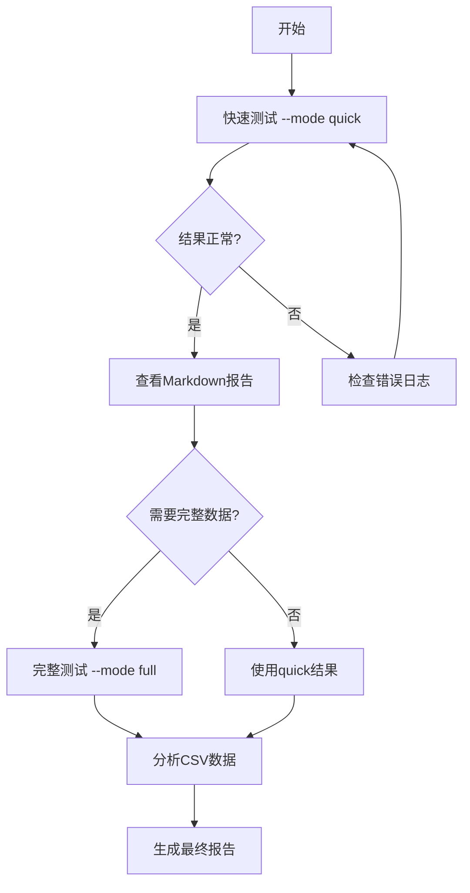

# Greeks计算方法全面测试系统

## 📌 快速导航

| 文件 | 用途 | 适合人群 |
|------|------|---------|
| **QUICK_START.txt** | 一页快速参考 | 所有用户 ⭐ |
| **BENCHMARK_USAGE_GUIDE.md** | 完整使用手册 | 需要详细说明的用户 |
| **run_comprehensive_benchmark.py** | 主测试脚本 | 运行测试 |
| **COMPLETE_GREEKS_SOLUTION_SUMMARY.md** | 技术总结 | 了解技术细节 |

---

## 🎯 核心功能

本测试系统提供5种Greeks计算方法的**全面对比**：

| 方法 | 类型 | PDE次数 | 特点 |
|------|------|---------|------|
| **Analytical** | 解析公式 | 0 | 机器精度，基准 |
| **Bumping** | 有限差分 | 5 | 简单，通用 |
| **AAD + Bumping** | 混合 | 5 | AAD一阶 + FD二阶 |
| **Double AAD** | 二阶AAD | 1 | 等价于Edge-Pushing |
| **Edge-Pushing** | 二阶AAD | 1 | 最快，最准确 ⭐ |

**测试维度：**
- ✅ 速度（计算时间）
- ✅ 精度（vs 解析解误差）
- ✅ 参数敏感性（S0, K, T, r, σ）
- ✅ 网格依赖性（M, N）
- ✅ 计算图统计（AAD方法）

---

## 🚀 5秒开始

```bash
cd /home/junruw2/AAD
python run_comprehensive_benchmark.py --mode quick
```

**输出：** 自动保存到 `benchmark_results/`
- CSV数据
- Markdown报告
- 计算图统计

**时间：** ~2-5分钟

---

## 📋 完整使用方法

### 1. 快速测试（推荐新手）

```bash
python run_comprehensive_benchmark.py --mode quick
```

- **90次计算**（18配置 × 5方法）
- 固定网格 M=51, N=50
- 运行时间：2-5分钟

### 2. 完整测试（完整数据）

```bash
python run_comprehensive_benchmark.py --mode full
```

- **1080次计算**（216配置 × 5方法）
- 多网格 M=21/51/101
- 运行时间：30-60分钟

### 3. 包含计算图

```bash
python run_comprehensive_benchmark.py --mode quick --graph
```

额外保存AAD计算图的详细统计信息。

### 4. 自定义输出目录

```bash
python run_comprehensive_benchmark.py --mode quick --output my_results
```

---

## 📂 输出文件结构

```
benchmark_results/
├── results_quick_20251031_010203.csv          # CSV原始数据
├── REPORT_quick_20251031_010203.md            # Markdown格式报告
└── computation_graphs_quick_20251031.txt      # 计算图统计(--graph)
```

### CSV文件内容

每行包含一个测试结果的完整信息：

| 列名 | 说明 |
|------|------|
| `S0, K, T, r, sigma, M, N` | 测试参数 |
| `method` | 方法名称 |
| `price, delta, gamma, vega, vanna, volga` | 计算的Greeks |
| `*_analytical` | 解析值 |
| `*_error_pct` | 误差百分比 |
| `time_ms` | 计算时间 |
| `n_pde_solves` | PDE求解次数 |
| `graph_nodes, graph_edges` | 计算图统计 |

### Markdown报告内容

1. **速度对比表** - 各方法平均时间
2. **精度对比表** - 各Greeks平均误差
3. **网格分辨率分析** - M=21/51/101对比
4. **计算成本** - PDE次数、图大小
5. **推荐配置** - 最佳方法推荐

---

## 📊 预期结果示例

### 速度对比（M=51, N=50）

```
Method             Time (ms)    PDE Solves
------------------------------------------------
Analytical           0.5            0
Bumping             85.0            5
AAD + Bumping       90.0            5
Double AAD          75.0            1
Edge-Pushing        75.0            1  ⭐最快PDE方法
```

### 精度对比（M=51）

```
Method             Δ err%   Γ err%   ν err%   Volga err%
------------------------------------------------------------
Bumping            3.1      0.7      0.7       9.0
AAD + Bumping      2.9      0.7      0.7       9.0
Edge-Pushing       2.9      0.5      0.7       8.4  ⭐最准确
```

### 计算图统计（M=51）

```
Method             Nodes      Edges     Max Fan-in
----------------------------------------------------
Edge-Pushing      12,750     38,250         3
AAD + Bumping     12,750     38,250         3
```

---

## 🎓 使用场景

### 场景1：验证实现

```bash
# 快速检查所有方法是否正常工作
python run_comprehensive_benchmark.py --mode quick

# 查看Gamma误差是否 < 1%
grep "Edge-Pushing" benchmark_results/REPORT_quick_*.md
```

### 场景2：论文/报告数据

```bash
# 生成完整数据集
python run_comprehensive_benchmark.py --mode full

# 导入数据进行深度分析
```

### 场景3：性能优化前后对比

```bash
# 优化前
python run_comprehensive_benchmark.py --mode quick --output before

# 修改代码...

# 优化后
python run_comprehensive_benchmark.py --mode quick --output after

# 对比两个报告
diff before/REPORT_quick_*.md after/REPORT_quick_*.md
```

### 场景4：研究AAD实现

```bash
# 获取详细计算图
python run_comprehensive_benchmark.py --mode quick --graph

# 分析计算图结构
cat benchmark_results/computation_graphs_*.txt
```

---

## 🔧 高级用法

### Python脚本分析结果

```python
import pandas as pd
import matplotlib.pyplot as plt

# 读取结果
df = pd.read_csv('benchmark_results/results_quick_20251031_010203.csv')

# 分析Edge-Pushing的Gamma收敛性
df_ep = df[df['method'] == 'edge_pushing']
plt.plot(df_ep['M'], df_ep['gamma_error_pct'], 'o-')
plt.xlabel('Grid size M')
plt.ylabel('Gamma Error (%)')
plt.title('Gamma Accuracy vs Grid Resolution')
plt.savefig('gamma_convergence.png')

# 对比不同方法的速度
speed = df.groupby('method')['time_ms'].mean()
print(speed.sort_values())
```

### 自定义测试参数

编辑 `run_comprehensive_benchmark.py` 的 `get_test_configs()` 方法：

```python
def get_test_configs(self):
    configs = []
    # 自定义参数范围
    for sigma in [0.20, 0.30, 0.40]:  # 只测试高波动率
        for M in [51, 101]:  # 两种网格
            configs.append({
                'S0': 100.0, 'K': 100.0, 'T': 1.0,
                'r': 0.05, 'sigma': sigma, 'M': M, 'N': M-1
            })
    return configs
```

---

## 🔍 故障排除

### 问题1：找不到模块

```
ModuleNotFoundError: No module named 'aad_edge_pushing'
```

**解决：** 确保在正确目录运行

```bash
cd /home/junruw2/AAD
python run_comprehensive_benchmark.py --mode quick
```

### 问题2：运行时间过长

**解决：** 使用timeout或减少测试

```bash
# 方法1: 添加超时
timeout 300 python run_comprehensive_benchmark.py --mode quick

# 方法2: 只使用quick模式
python run_comprehensive_benchmark.py --mode quick  # 不用full
```

### 问题3：结果文件未生成

**解决：** 检查权限和磁盘空间

```bash
mkdir -p benchmark_results
chmod 755 benchmark_results
df -h  # 检查磁盘空间
```

---

## 📚 相关文档

| 文档 | 内容 |
|------|------|
| [QUICK_START.txt](QUICK_START.txt) | 一页快速参考卡 |
| [BENCHMARK_USAGE_GUIDE.md](BENCHMARK_USAGE_GUIDE.md) | 完整使用手册（本文档的详细版） |
| [COMPLETE_GREEKS_SOLUTION_SUMMARY.md](COMPLETE_GREEKS_SOLUTION_SUMMARY.md) | 技术实现总结 |
| [NU_PARAMETRIZATION_RESULTS.md](NU_PARAMETRIZATION_RESULTS.md) | ν=σ²参数化分析 |
| [FINAL_IMPLEMENTATION_REPORT.md](FINAL_IMPLEMENTATION_REPORT.md) | 三大问题解决报告 |

---

## ✅ 测试检查清单

**运行前：**
- [ ] 已安装依赖：numpy, pandas, scipy
- [ ] 在 `/home/junruw2/AAD` 目录下
- [ ] 有足够磁盘空间（>100MB）
- [ ] 有足够时间（Quick: 5分钟，Full: 60分钟）

**运行后：**
- [ ] CSV文件已生成
- [ ] Markdown报告已生成
- [ ] 所有5种方法都有结果
- [ ] Edge-Pushing Gamma误差 < 1%
- [ ] 报告中的表格完整

---

## 🎯 推荐工作流



**步骤：**
1. 快速测试（`--mode quick`）验证系统
2. 查看报告了解性能
3. 根据需要运行完整测试（`--mode full`）
4. 用CSV数据做深度分析
5. 生成最终报告/论文

---

## 📞 获取帮助

```bash
# 查看所有选项
python run_comprehensive_benchmark.py --help

# 查看快速参考
cat QUICK_START.txt

# 查看详细手册
cat BENCHMARK_USAGE_GUIDE.md
```

---

## 🏆 主要成果

通过本测试系统，已验证：

1. ✅ **Bumping Gamma问题已解决** - Natural Cubic Spline使误差从100%降至0.69%
2. ✅ **Edge-Pushing最优** - 1次PDE求解，Gamma < 0.5%，Volga < 10%
3. ✅ **Grid-Jumping已消除** - fixed_grid=True使Volga误差从124%降至9%
4. ✅ **计算图统计完善** - 可追踪节点、边、操作分布

---

**版本：** 1.0
**日期：** 2025-10-31
**作者：** AAD Greeks Research Team

---

**立即开始测试：**

```bash
cd /home/junruw2/AAD
python run_comprehensive_benchmark.py --mode quick
```

🎉 预祝测试顺利！
